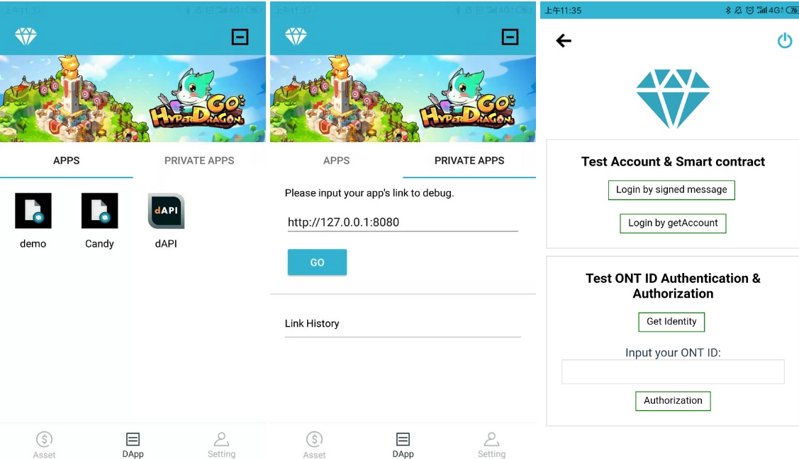
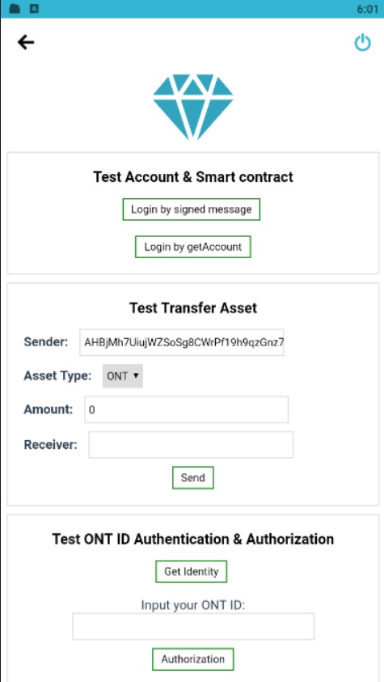
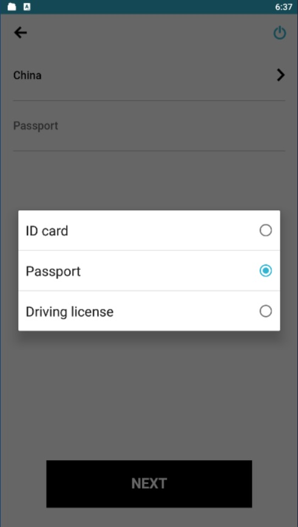
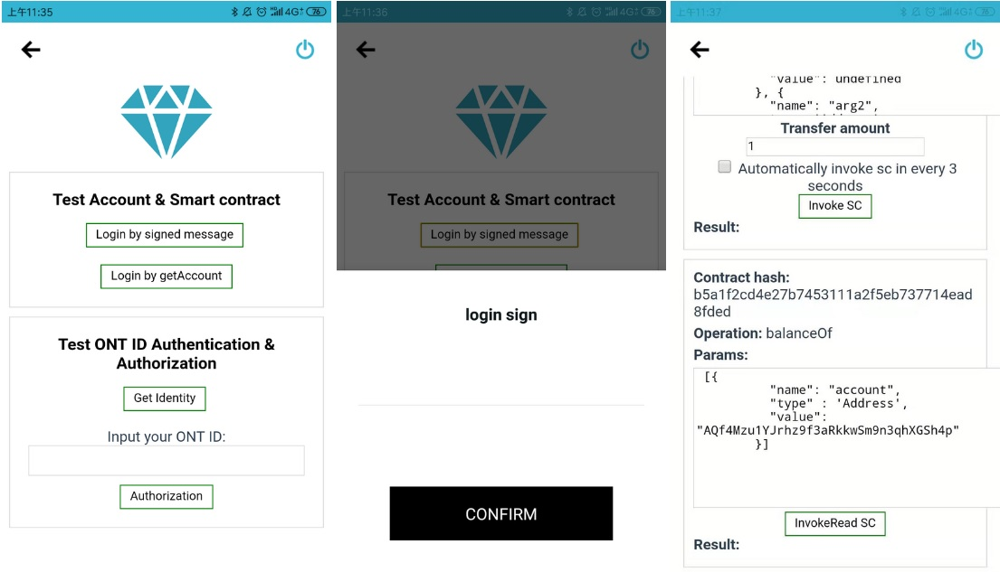
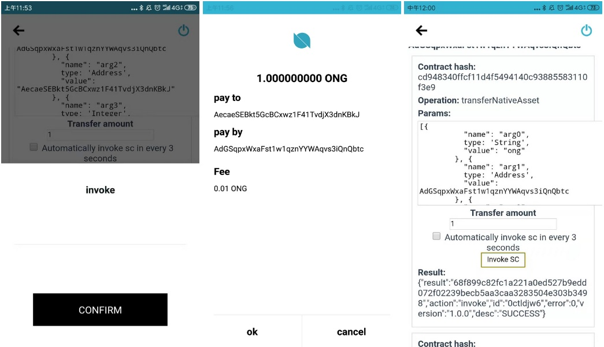

# dAPI 사용법 (dAPI Integration)

## 주요 기능

개발자의 관점에서, 온톨로지 체인과의 상호작용을 원활하게 하는 기능들은 크게 아래와 같이 4가지로 구분될 수 있을 것입니다 (로그인, 거래, 스마트 컨트랙트 개발, 자산 토큰화): 

* _**로그인:**_  사용자들로 하여금 신원 인증을 가능케하고, 계정 혹은 신원과 관련된 정보를 받아올 수 있게 합니다. 
* _**거래:**_   `ONT` 와 `ONG` 그리고 다른 `OEP` 형태의 토큰이 사용된 모든 종류의 거래를 스마트 컨트랙트 배포를 통하여 사용할 수 있습니다. 아래에서 `ONG` 기반 거래의 예시를 볼 수 있습니다.

```python
OntCversion = '2.0.0'
from ontology.interop.Ontology.Native import Invoke
from ontology.builtins import state
from ontology.interop.System.Runtime import Notify
from ontology.interop.System.ExecutionEngine import GetExecutingScriptHash
from ontology.interop.Ontology.Runtime import Base58ToAddress,AddressToBase58


# ONG Big endian Script Hash: 0x0200000000000000000000000000000000000000
OngContract = Base58ToAddress("AFmseVrdL9f9oyCzZefL9tG6UbvhfRZMHJ")


def Main(operation, args):
    if operation == "transferOng":
        if len(args) != 3:
            return False
        return transferOng(args[0], args[1], args[2])

    return False

def transferOng(from_base58, to_base58,  ong_amount):
    from_acct = Base58ToAddress(from_base58)
    to_acct = Base58ToAddress(to_base58)
    param = state(from_acct, to_acct, ong_amount)
    res = Invoke(0, OngContract, "transfer", [param])
    if res and res == b'\x01':
        Notify([True,from_base58, to_base58,  ong_amount])
        return True
    else:
        Notify([False,from_base58, to_base58,  ong_amount])
        return False


```

* _**스마트 컨트랙트 개발:**_  현재로서, `탈중앙화 앱`을 기획 및 게발한다고 했을 때, 핵심 논리를 구현하는데 있어서 거의 모든 프로젝트들은 전적으로 혹은 부분적으로 스마트컨트랙트를 사용하고 이에 의존합니다. 예를 들어, 게임을 봅시다. 구매, 판매, 대여 또는 난수 생성 기타 등등과 같은 함수들은 스마트 컨트랙트를 사용하여 쉽게 구현될 수 있습니다. 스마트 컨트랙트에 대한 더 정확한 정보는 [여기](../../../../untitled-1/smart-contract.md) 에서 확인할 수 있습니다.
* _**자산 토큰화:**_  개발자들은 다양한 방법으로 자산 토큰화 혹은 토큰 발행을 할 수 있습니다. 예를 들어, `OEP4`, `OEP5`, `OEP8` 등등으로 말입니다. 상기 자산들에 대한 더 정확한 정보들은 [여기](../../../../untitled-1/tokens-and-assets.md)에서 볼 수 있습니다.

## 통합 방법 (Integration Options)

온톨로지는 개발자들이 직면할 여러가지 상황들과 시나리오를 고려하여 플랫폼을 `dApp`과 통합할 수 있는 다양한 방법들을 제공합니다.

* `탈중앙화앱`을 지갑에서 실행하던 `Cyano` 지갑 크롬 플러그인을 사용하던 `dAPI`를 사용하는 여러가지 탈중앙화 방법들 모두는 체인과 상호작용을 할 수 있게 합니다.

* 다수의 `SDK들` 중 하나를 사용하여 통합하는 방식 역시, 코어단에서 바라보면 탈중앙화 되어있습니다. 예를 들어, `Unity 3D` 엔진이나 `C#` 을 이용한 게임을 예로 들자면 관련된 `SDK들`을 통하여 통합해야 할 것입니다. 

* ONT ID를 사용하여 어플리케이션을 오픈 플랫폼으로 만들 수 있습니다. 하지만, 이 방법은 완벽하게 탈중앙화되어 있다고 할 수 없습니다. 

위에서 언급된 방법중들 어떤 것들을 사용하더라도 로그인 기능과 스마트 컨트랙트 배포 기능에는 영향을 미치지 않습니다. 그러므로, 개발자는 본인이 원하는 방법을 선택하여 `dApps`와 통합하면 됩니다.

위에서 논의한 것처럼, `탈중앙화 앱`을 통합하는 방법은 2가지가 있습니다. 그리고 그 2가지는 사실상 모두 같은 기능을 수행합니다. 선택은 개발자가 하는 것입니다.

브라우저와 모바일 버전 모두에서 `탈중앙화 앱`을 사용힐 수 있는, `dAPI`를 사용하는 3가지 다른 시나리오들을 제공하려고 합니다. 아래에서 볼 수 있습니다 :

* **모바일 버전** `dAPI` **적용 -** [_dAPI for mobile_](https://github.com/ontio-cyano/cyano-bridge)\_\_
* **크롬 플러그인 지갑** `dAPI` **적용 -** [_dAPI for chrome_](https://github.com/ontio/ontology-dapi)\_\_
* **크롬 플러그인과 모바일 버전에 모두 적용되는(compatible) 예시** `dAPI` **코드 -** [_dAPI-universal_](https://github.com/ontio-cyano/dapi-universal)\_\_

## dAPI 사용법 (dAPI Compatibility)

기존의 전통적인 앱들과는 달리, `탈중앙화 앱`은 계정들을 관리하는 중앙화된 백엔드 플랫폼이 없습니다. 사용자들은 자신의 신원과 자산을 온전히 소유하고 통제합니다. 이것이 앱의 로직을 설계할 때 스마트 컨트랙트를 사용하는 것 이외에, `탈중앙화 앱`이 체인과 상호작용하고 통신할 수 있는 여러가지 방법들을 구축해야 하는 이유입니다.

`탈중앙화 앱` 개발의 진입장벽을 낮추기 위해서, 온톨로지는 다양한 종류의 `dAPI`를 제공합니다. 이는 `탈중앙화 앱`들이 체인과 통신을 할 수 있게 합니다. 온톨로지의 현재 프레임워크와 기술은 모든 종류의 mainstream 기기들과 호환이 되고 그 위에서 `탈중앙화 앱`을 실행할 수 있습니다. 

현재로서는, 아래의 시나리오들이 지원됩니다 : 

* **탈중앙화 앱으로 크롬 지갑 플러그인 호출하기**
* **모바일 지갑내에서 탈중앙화 앱 실행하기**
* **지갑에서 탈중앙화 QR코드를 스캔하기**
* **어플리케이션에서 모바일 지갑 호출하기**

그리고 dAPI 프로토콜이 지원하는 지갑들은 아래와 같습니다 :

* Math wallet
* Banko
* Huobi wallet

추가로, dAPI를 현재 사용하는 탈중앙화 앱들은 아래의 링크에서 찾을 수 있습니다. 



브라우저와 모바일에서 모두 `탈중앙화 앱`에 사용할 수 있게 하기 위해서, 온톨로지에서는 `dAPI`를 사용하는 3가지 예시 시나리오를 제시합니다. 

* **모바일 버전** `dAPI` **적용 -** [_모바일 전용 dAPI_](https://github.com/ontio-cyano/cyano-bridge)\_\_
* **크롬 플러그인 지갑** `dAPI` **적용 -** [_크롬 전용 dAPI_](https://github.com/ontio/ontology-dapi)\_\_
* **크롬 플러그인과 모바일 버전 모두와 호환되는 버전** `dAPI` **코드 -** [_dAPI-universal_](https://github.com/ontio-cyano/dapi-universal)\_\_

## 지갑 데모 (Wallet Demonstration)

지갑을 통해 `탈중앙화 앱`을 실행하는 가장 흔하고 쉬운 방법이 아래에 서술되어 있습니다. 과정과 더불어  몇가지 기본적인 기능들 역시 같이 서술하였습니다. 


**H5 탈중앙화 앱 데모버전 소스 코드:**  [https://github.com/ontio-cyano/mobile-dapp-demo](https://github.com/ontio-cyano/mobile-dapp-demo)

**H5 탈중앙화 앱 데모버전 링크:** [http://101.132.193.149:5000/\#/](http://101.132.193.149:5000/#/)

**Cyano 지갑 모바일 버전 \(안드로이드\):** [http://101.132.193.149/files/app-debug.apk](http://101.132.193.149/files/app-debug.apk)


`Cyano` 지갑을 설치한 후에는, 데모 앱에서 거래를 발생시켜서 `탈중앙화 앱`을 테스트 할 수 있습니다.

### 1. 지갑에서 탈중앙화 앱을 실행하십시오. 

지갑을 실행하고 "Dapp" 섹션으로 이동합니다. "PRIVATE APPS" 탭으로 이동하여 주소를 입력하고 데모버전 `탈중앙화 앱` 에 접근하십시오: [http://101.132.193.149:5000/\#/](http://101.132.193.149:5000/#/)

만약 당신이 개발한 어플리케이션을 열고 싶다면 `탈중앙화 앱`을 배포한 당신의 로컬 지갑 주소를 입력하면 됩니다.



### 2. 계정 및 신원 정보 불러오기



신원 가져오기를 클릭하면 계정의 ONT ID를 바로 불러옵니다. 작업이 완료되면 비밀번호를 입력하십시오. 입력 후에는 아래의 빈칸에 ID가 나타날 것입니다. 서류 정보 등을 업로드하여 인증/KYC를 진행할 수 있습니다. 예를 들면, 여권 번호 혹은 그 제일 앞 면 등으로 가능합니다. 



### 3. 탈중앙화 앱에 로그인 하기



사용자의 신원을 확인해야 할 때는 지갑으로 탈중앙화 앱이 메세지를 보냅니다. 그리고 서명 작업을 진행한 후에 그 검증을 진행합니다. 

위에서 설명했던 것처럼, 지갑은 사용자들로 하여금 비밀번호를 입력하게 합니다. 그 후에 확인이 된다면, 계약 세부 사항에 접근할 수 있습니다. 

### 4. 탈중앙화 컨트랙트 배포



컨트랙트 배포는 아래의 과정들을 포함합니다 : 

1. 서명 검증이 끝나면, 컨트랙트는 pre-processed 상태가 됩니다. 
2. 사용자는 이를 확인 및 검증하고 지갑을 통해 해당 거래를 전송합니다. 
3. 거래의 `해시` 값은 `dApp`에 돌아옵니다.

`dAPI` 를 이용한 통합 방법에는 2가지 장점이 있습니다.

* 사용자는 자산과 데이터의 보유 상태를 유지할 수 있습니다. 
* 지갑으로 탈중앙화 앱에 로그인 하는 부분은 추가로 구현할 필요가 없으며 동시에 이용하기도 쉬울 것입니다.

**통합 프로토콜** 에 대한 더 많은 정보는 [아래](https://github.com/ontio-cyano/CEPs/blob/master/CEPS/CEP1.mediawiki)의 링크에서 볼 수 있습니다.
