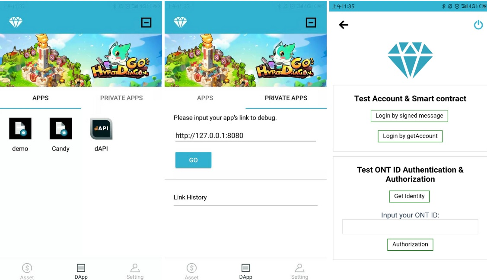

# dAPI Integration

## Primary Functionality

From a developer's point of view, the functions that facilitate interaction with Ontology's chain can be broadly categorized as follows:

* _**Login:**_  Allows user identity verification, and querying account or identity related information
* _**Transactions:**_  The transaction service for both `ONT` and `ONG`, or the other `OEP` token related transactions can be carried out by deploying smart contracts. An example of an `ONG` based transaction-

```python
OntCversion = '2.0.0'
from ontology.interop.Ontology.Native import Invoke
from ontology.builtins import state
from ontology.interop.System.Runtime import Notify
from ontology.interop.System.ExecutionEngine import GetExecutingScriptHash
from ontology.interop.Ontology.Runtime import Base58ToAddress,AddressToBase58


# ONG Big endian Script Hash: 0x0200000000000000000000000000000000000000
OngContract = Base58ToAddress("AFmseVrdL9f9oyCzZefL9tG6UbvhfRZMHJ")


def Main(operation, args):
    if operation == "transferOng":
        if len(args) != 3:
            return False
        return transferOng(args[0], args[1], args[2])

    return False

def transferOng(from_base58, to_base58,  ong_amount):
    from_acct = Base58ToAddress(from_base58)
    to_acct = Base58ToAddress(to_base58)
    param = state(from_acct, to_acct, ong_amount)
    res = Invoke(0, OngContract, "transfer", [param])
    if res and res == b'\x01':
        Notify([True,from_base58, to_base58,  ong_amount])
        return True
    else:
        Notify([False,from_base58, to_base58,  ong_amount])
        return False


```

* _**Smart contract development:**_  As far as the vast majority of `dApps` are concerned, logic implementation either relies completely, or at least in part, on smart contracts. Considering games, for instance, functions such as buying, selling, renting, or generating random numbers, etc. can conveniently be implemented using smart contracts. For more details on smart contracts, feel free to check [this](../../../../untitled-1/smart-contract.md) out.
* _**Tokenizing assets:**_  Developers always have the option to tokenize and issue many different types of assets, such as `OEP4`, `OEP5`, `OEP8`, etc. For a more detailed explanation of the aforementioned assets, refer to [this](../../../../untitled-1/tokens-and-assets.md).

## Integration Options

Keeping in mind the different circumstances and scenarios that the developers might be working with, Ontology provides multiple ways to integrate the platform into a `dApp`.

* The multiple decentralized methods that use the `dAPI`, including the option to open a `dApp` from within the wallet, and the `Cyano` wallet chrome plugin, all allow the `dApp` to interact with the chain.
* Integrating using one of the multiple `SDKs`,  a method which is also decentralized at its core. For example, games that use the `Unity 3D` engine and `C#`. would encounter the need to integrate through the respective `SDKs`.
* Making the application open-platform using the ONT ID. Though, this method is not completely decentralized.

No matter which one of the above methods you choose to integrate your `dApp`,  the login feature and the ability to deploy smart contracts remains constant and unaffected. Therefore, developers can freely choose any of the method to integrate `dApps`.

To implement the functions discussed above, there are two technically decentralized `dApp` integration methods, both of which offer the same functionality in every way. The choice rests with the developer.

## dAPI Compatability

Unlike traditional apps, a `dApp` doesn't have a centralized back end platform that manages accounts. The user maintains full possession and control of their identity and assets. That is the reason why apart from building the app's logic using smart contracts, `dApps` need to employ various means to interact and communicate with the chain.

To bring down the difficulty level of `dApp` development, Ontology provides plenty of `dAPI` methods for developers to use and allow `dApps` to communicate with the chain. Ontology's current framework and technology is compatible with, and can run a `dApp` on virtually any mainstream device.

Currently, the following scenarios are supported-

* **dApp invokes the Chrome wallet plugin**
* **The dApp can be launched from within the mobile wallet**
* **The wallet can scan dApp QR codes**
* **Application calls the mobile wallet**

Wallets that already support dAPI protocol-

* Math wallet
* Banko
* Huobi wallet

The dApps that are currently using dAPI can be found by following the below link-

[https://github.com/ontio-community/dapp-store](https://github.com/ontio-community/dapp-store)

## Wallet Demonstration

The most common method of launching a `dApp` from within the wallet is illustrated here. The process and a few basic functions are demonstrated below.


**H5 demo dApp source code:**  [https://github.com/ontio-cyano/mobile-dapp-demo](https://github.com/ontio-cyano/mobile-dapp-demo)

**H5 demo dApp link:** [http://101.132.193.149:5000/\#/](http://101.132.193.149:5000/#/)

**Cyano wallet mobile version \(Android\):** [http://101.132.193.149/files/app-debug.apk](http://101.132.193.149/files/app-debug.apk)


After completing the installation of `Cyano` wallet, you can test your `dApp` by performing transactions through the demo app.

### 1. Open a dApp in the wallet

Launch the wallet and access the "DApp" section. Open the "PRIVATE APPS" tab and input this address to access the demo `dApp`: [http://101.132.193.149:5000/\#/](http://101.132.193.149:5000/#/)

You can also input your local address where you have deployed your `dApp` to open your own app.




### 2. Fetch Account or Identity Information


Clicking on the Get Identity button will directly fetch the ONT ID of the account. Enter the password when prompted and the ID will appear in the blank field below. You can carry out the authorization/KYC by uploading your document information, for e.g, passport number, picture of the first page, etc.


### 3. Login into the dApp


In case there is a need to verify the user's identity, dApp sends a message to the wallet to carry out the signature process, and then verifies the signature.

As illustrated above, the wallet prompts the user to enter the password. Once confirmed, the contract related details can be accessed.

### 4. dApp Contract Deployment


The contract deployment process involves the following steps:

1. After the signature verification is completed successfully, the contract is pre-processed.
2. The user confirms and transmits the transaction via the wallet.
3. The `hash` value of the transaction is returned to the `dApp`.


 

There are 2 advantages of using the the `dAPI` integration method-

* The user can maintain possession of the assets and data.
* The wallet login dApp can be readily integrated and conveniently used.

For detailed information on the **integration protocol,** please follow [this](https://github.com/ontio-cyano/CEPs/blob/master/CEPS/CEP1.mediawiki) link.


