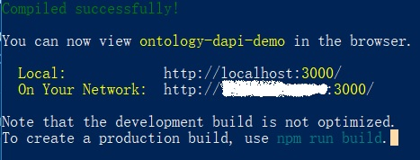
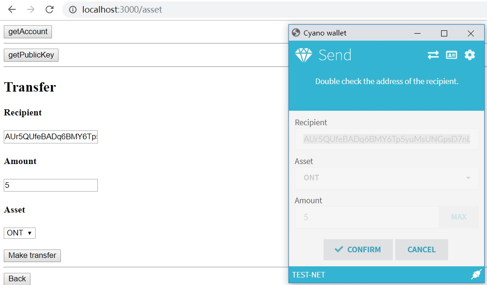
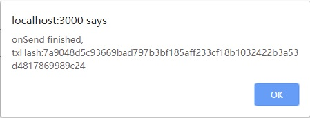
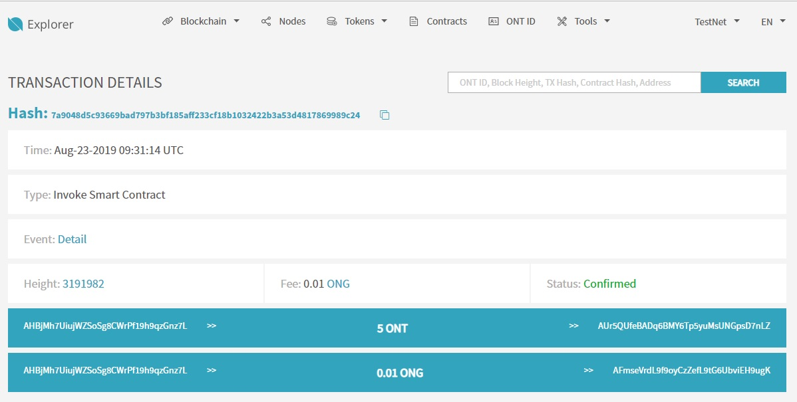

# Using the dAPI

The `dAPI` has been created to specifically facilitate `dApp` development. It supports browser \(currently limited to Google Chrome\) and mobile based `dApp` development \(implemented using `Cyano` wallet that employs `dAPI` interface\).

The mobile version of `dAPI` provides a limited number of the more significant interfaces only. The interfaces that query block transactions, or other interfaces that perform similar functions can directly invoke the `explorer` API interface. The `dAPI` interface set of the `chrome` plug-in is overall more comprehensive.


The code written in the two different environments is not mutually interchangeable currently. For compatibility related information, please refer: [dapi-universal](https://github.com/ontio-cyano/dapi-universal)


This guides aims at providing a surface level introduction for some of the more commonly used interfaces- login, signature data, contract query, and contract invocation.


Note: The data returned by the `dAPI` interface is referred to as "Promise"


## Configuration Process


### 1. Installing dAPI

The first step is to install and set-up Ontology's `dAPI` package.


Ensure that Node.js is configured properly on your system. The installation process uses `npm` commands.


#### Chrome version-

```bash
npm install ontology-dapi
```

#### Mobile version-

```bash
npm install cyanobridge
```

### 2. Initialization

A contract must be initialized before it is invoked.

#### Chrome version

```javascript
import {client} from 'ontology-dapi'
client.registerClient({})
```

#### Mobile version

```javascript
import {client} from 'cyanobridge'
client.registerClient();
```

### 3. Login

There are two ways to implement the login mechanism in a `dApp`:

* Use the `dAPI` to directly fetch the user's account address or `ONT ID`. If the information can be retrieved successfully, it indicates the logged in state with respect to the `dApp`.
* The dApp back end generates a string and sends it to the front end, and the front end invokes the dAPI requesting it to assign a signature to it, and then returning it to the back end. If the back end can successfully verify this signature, the user can be considered to have logged in successfully. Next, the back end can issue `access tokens` to the user. This depends on the business logic of the `dApp`.


For more information on the method to implement back end signature verification, consider referring-

* [Java SDK signature verification](https://github.com/ontio/ontology-java-sdk/blob/master/docs/en/interface.md#verify-signature)
* [TypeScript SDK signature verification](https://github.com/ontio/ontology-ts-sdk/blob/master/test/ecdsa.crypto.test.ts)


### **Fetching Account Information or Identity**

While fetching the account or identity information, the users working with the mobile version `API` may choose not to submit the `dApp` information and leave the fields empty.

#### Mobile version

```javascript
import { client } from 'cyanobridge'

const params = {
    dappName: 'My dapp',
    dappIcon: '' // a URL that points to the dApp icon resource
}

try {
    const res = await client.api.asset.getAccount(params);
    const res = await client.api.identity.getIdentity(params);
    console.log(res)
} catch(err) {
    console.log(err)
}
```

#### Chrome version

```javascript
account = await client.api.asset.getAccount()
res = await client.api.identity.getIdentity();
```

### 4. Data Signature

Here's some sample code to exemplify how the the signature mechanism can be carried out by the back end.

#### Mobile version

```javascript
const params = {
    type: 'account',// account or identity that will sign the message
    dappName: 'My dapp', // dapp's name
    dappIcon: 'http://mydapp.com/icon.png', // the URL that points to the dapp's icon resource
    message: 'test message', // message sent from dapp that will be signed by native client
    expired: new Date('2019-01-01').getTime(), // expiry date of login
    callback: '' // callback url of dapp
}
let res;
try {
    res = await client.api.message.login(params);
    console.log(res)
}catch(err) {
    console.log(err)
}
```

#### Chrome version

```javascript
const result = await client.api.message.signMessage({message});
```

### 5. Contract invocation

Contract invocations are mainly of two types: _execution_ and _pre-execution_.

Pre-execution invocations normally involve using the contract's query interfaces, while the execution invocations directly use the contract itself. Pre-execution calls generally do not trigger the consensus mechanism. For example, in a game of rolling dice, a pre-execution invocation can query the result of a dice roll, and by the means of an execution invocation the specific method of a dice roll can be fetched.

_**Execution invocation sample code-**_

#### Mobile version

```javascript
const scriptHash = 'cd948340ffcf11d4f5494140c93885583110f3e9';
const operation = 'test'
const args = [
    {
        type: 'String',
        value: 'helloworld'
    }
]
const gasPrice = 500;
const gasLimit = 20000;
const payer = 'AecaeSEBkt5GcBCxwz1F41TvdjX3dnKBkJ'
const config = {
    "login": true,
    "message": "invoke smart contract test",
    "qrcodeUrl": "" ,
    "callback": ""
}
const params = {
          scriptHash,
          operation,
          args,
          gasPrice,
          gasLimit,
          payer,
          config
        }
try {
   const res = await client.api.smartContract.invoke(params);
   } catch(err) {
    console.log(err)
}
```

#### Chrome version

```javascript
const scriptHash = '16edbe366d1337eb510c2ff61099424c94aeef02';
const gasLimit = 30000;
const gasPrice = 500;
const operation = 'test'

const args = [
   {
    name: "msg",
    type: "String",
    value: "hello world"
   }
]
 params = {
            scriptHash,
            operation,
            args,
            gasPrice,
            gasLimit
}
await client.api.smartContract.invoke(params)

```

## dAPI demonstration

The concepts explained above help create a foundation level understanding of how Ontology's `dAPI` works and a few ways in which it can used in a `dApp`.

The following demonstration will illustrate how the `dAPI` would function when integrated with a `dApp`, both the browser and mobile versions.

Here's a link to the sample mobile `dApp` [http://101.132.193.149:5000/](http://101.132.193.149:5000/); the original code can be found [here](https://github.com/ontio-cyano/mobile-dapp-demo).

A browser based sample `dApp` is demonstrated below. The developers working with the Chrome plugin version may refer to the original code [here](https://github.com/OntologyCommunityDevelopers/ontology-dapi-demo).

First, the git repository needs to be cloned to the system and installed. The process can be carried out as follows.

```bash
$ git clone https://github.com/OntologyCommunityDevelopers/ontology-dapi-demo.git

$ npm install

$ npm run start
```



Upon successfully installing and running the application, it can be accessed using the address - [http://localhost:3000](http://localhost:3000).


Please ensure that the `Cyano` wallet Chrome extension is activated and running when the above page is opened.



Once the page opens, you can click on **Provider**, and then **GetProvider** on the next page to check whether or not the application is functioning properly. A prompt should display the version of `Cyano` you have installed.


At this point, the app has successfully established a connection and can interact with the chain by invoking the API. For instance,  return to the main page and click on **Network** -&gt; **GetBlock**. The app will return block related information, as such -


To demonstrate the functionality of the application we can carry out an account transfer. To do so, click on **Asset** -&gt; **Make Transfer**. A default address will by default appear in the address field.


The transaction takes place on the `test-net`. Please ensure that your wallet is connected to the test net so as to carry out the authorization protocol and then later on see the changes reflect in your wallet.


The `Cyano` wallet's confirmation window will automatically pop up. Confirm the transaction, and then once the transaction completes, it can be confirmed using Ontology's `Explorer` by using your public address or the transaction hash the Chrome prompt will display.





At this point, the changes will be reflected in your wallet. The amount that you selected, along with 0.01 ONG \(gas price\) will be deducted from your wallet. Other transaction related details can be found in the `explorer`. The explorer can be accessed from [here](https://explorer.ont.io).





